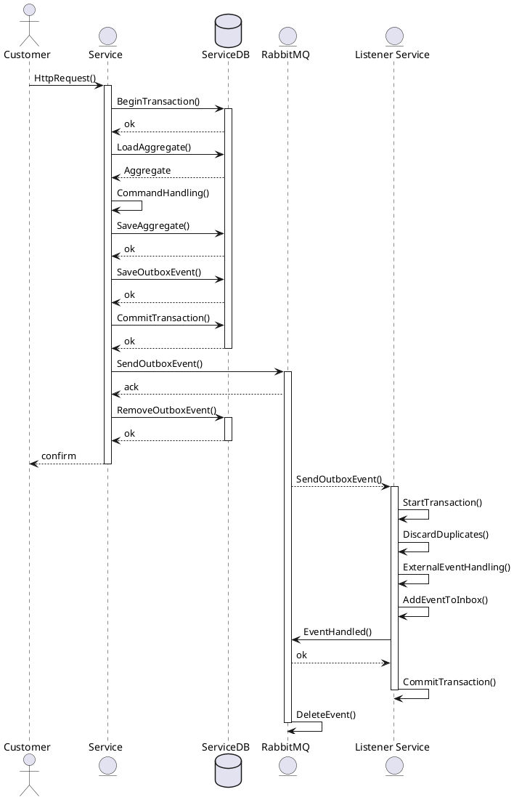
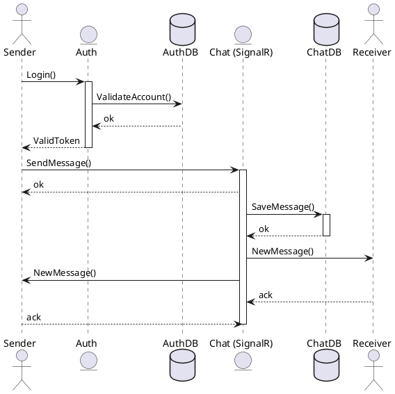
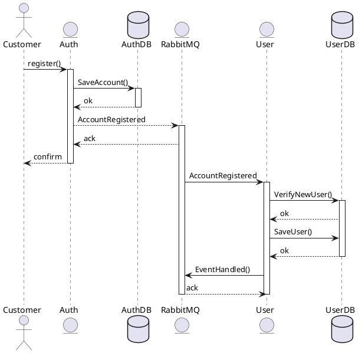
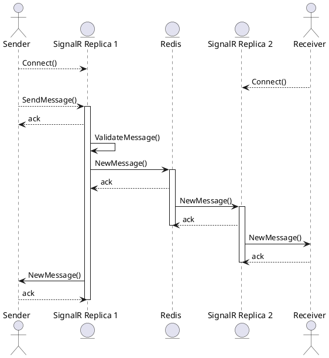

# Sequence Diagrams

## Command

```plantuml
@startuml Command
actor Customer
entity Service
database ServiceDB
entity RabbitMQ
entity "Listener Service" as Service2
Customer -> Service : HttpRequest()
activate Service
Service -> ServiceDB : BeginTransaction()
activate ServiceDB
ServiceDB --> Service : ok
Service -> ServiceDB : LoadAggregate()
ServiceDB --> Service : Aggregate
Service -> Service : CommandHandling()
Service -> ServiceDB : SaveAggregate()
ServiceDB --> Service : ok
Service -> ServiceDB : SaveOutboxEvent()
ServiceDB --> Service : ok
Service -> ServiceDB : CommitTransaction()
ServiceDB --> Service : ok
deactivate ServiceDB
Service -> RabbitMQ : SendOutboxEvent()
activate RabbitMQ
RabbitMQ --> Service : ack
Service -> ServiceDB: RemoveOutboxEvent()
activate ServiceDB
ServiceDB --> Service : ok
deactivate ServiceDB
Service --> Customer : confirm
deactivate Service
RabbitMQ --> Service2 : SendOutboxEvent()
activate Service2
Service2 -> Service2 : StartTransaction()
Service2 -> Service2 : DiscardDuplicates()
Service2 -> Service2 : ExternalEventHandling()
Service2 -> Service2 : AddEventToInbox()
Service2 -> RabbitMQ : EventHandled()
RabbitMQ --> Service2 : ok
Service2 -> Service2 : CommitTransaction()
deactivate Service2
RabbitMQ -> RabbitMQ : DeleteEvent()
deactivate RabbitMQ
@enduml
```

## Send message

```plantuml
@startuml SendMessage
actor Sender
entity Auth
database AuthDB
entity "Chat (SignalR)" as Chat
database ChatDB
actor Receiver
Sender -> Auth : Login()
activate Auth
Auth -> AuthDB : ValidateAccount()
AuthDB --> Auth : ok
Auth -->  Sender : ValidToken
deactivate Auth
Sender ->  Chat : SendMessage()
activate Chat
Chat -->  Sender : ok
Chat -> ChatDB : SaveMessage()
activate ChatDB
ChatDB --> Chat : ok
deactivate ChatDB
Chat -> Receiver : NewMessage()
Chat -> Sender : NewMessage()
Receiver --> Chat : ack
Sender --> Chat : ack
deactivate Chat
@enduml
```

## New user

```plantuml
@startuml NewUser
actor Customer
entity Auth
database AuthDB
entity RabbitMQ
entity User
database UserDB
Customer -> Auth : register()
activate Auth
Auth -> AuthDB : SaveAccount()
activate AuthDB
AuthDB --> Auth : ok
deactivate AuthDB
Auth --> RabbitMQ : AccountRegistered
activate RabbitMQ
RabbitMQ --> Auth : ack
Auth --> Customer : confirm
deactivate Auth
RabbitMQ -> User : AccountRegistered
activate User
User -> UserDB : VerifyNewUser()
activate UserDB
UserDB --> User : ok
User -> UserDB : SaveUser()
UserDB --> User : ok
deactivate UserDB
User -> RabbitMQ : EventHandled()
RabbitMQ --> User : ack
deactivate User
deactivate RabbitMQ
@enduml
```

## Send message with multiple chat replicas

```plantuml
@startuml SendMessageMultipleReplicas
actor Sender
entity "SignalR Replica 1" as Chat
entity Redis
entity "SignalR Replica 2" as Chat2
actor Receiver
Sender --> Chat : Connect()
Receiver --> Chat2 : Connect()
Sender -->  Chat : SendMessage()
activate Chat
Chat -->  Sender : ack
Chat -> Chat : ValidateMessage()
Chat -> Redis : NewMessage()
activate Redis
Redis --> Chat : ack
Redis -> Chat2 : NewMessage()
activate Chat2
Chat2 --> Redis : ack
deactivate Redis
Chat2 -> Receiver : NewMessage()
Receiver --> Chat2 : ack
deactivate Chat2
Chat -> Sender : NewMessage()
Sender --> Chat : ack
deactivate Chat
@enduml
```