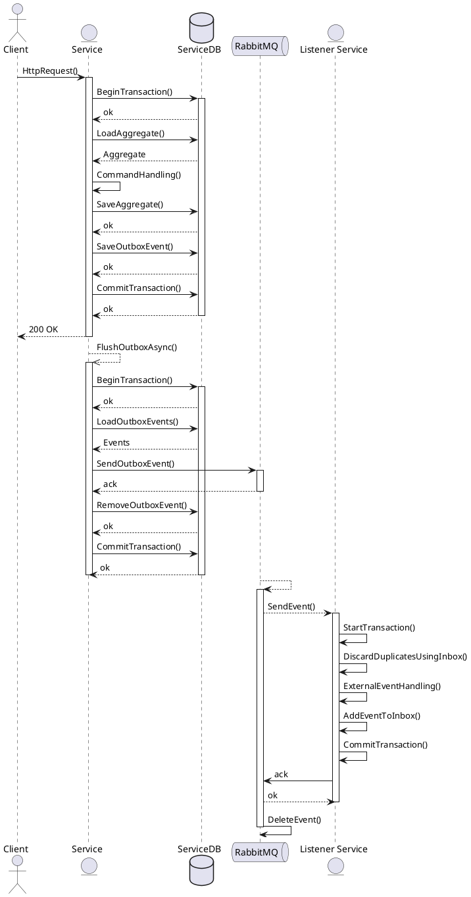
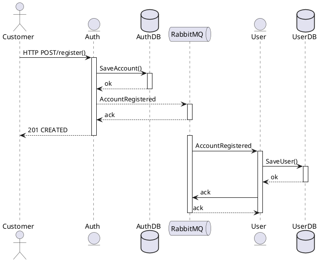
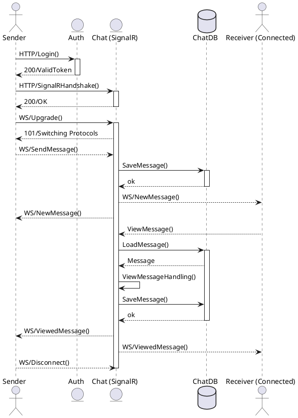
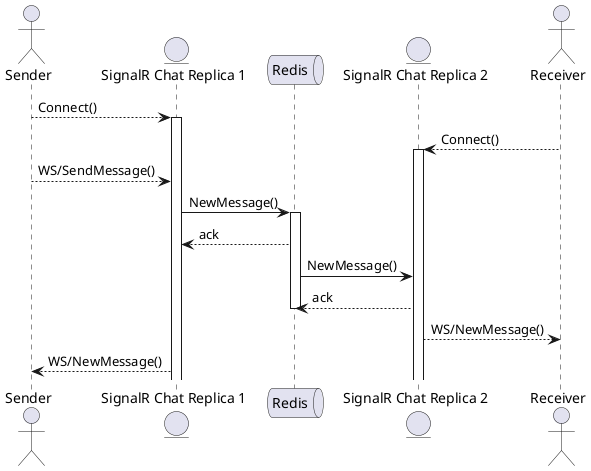

# Sequence Diagrams

## Command

```plantuml
@startuml Command
actor Client
entity Service
database ServiceDB
queue RabbitMQ
entity "Listener Service" as Service2
Client -> Service : HttpRequest()
activate Service
Service -> ServiceDB : BeginTransaction()
activate ServiceDB
ServiceDB --> Service : ok
Service -> ServiceDB : LoadAggregate()
ServiceDB --> Service : Aggregate
Service -> Service : CommandHandling()
Service -> ServiceDB : SaveAggregate()
ServiceDB --> Service : ok
Service -> ServiceDB : SaveOutboxEvent()
ServiceDB --> Service : ok
Service -> ServiceDB : CommitTransaction()
ServiceDB --> Service : ok
deactivate ServiceDB
Service --> Client : 200 OK
deactivate Service
Service -->> Service : FlushOutboxAsync()
activate Service
Service -> ServiceDB : BeginTransaction()
activate ServiceDB
ServiceDB --> Service : ok
Service -> ServiceDB : LoadOutboxEvents()
ServiceDB --> Service : Events
Service -> RabbitMQ : SendOutboxEvent()
activate RabbitMQ
RabbitMQ --> Service : ack
deactivate RabbitMQ
Service -> ServiceDB: RemoveOutboxEvent()
ServiceDB --> Service : ok
Service -> ServiceDB : CommitTransaction()
ServiceDB --> Service : ok
deactivate ServiceDB
deactivate Service
RabbitMQ --> RabbitMQ
activate RabbitMQ
RabbitMQ --> Service2 : SendEvent()
activate Service2
Service2 -> Service2 : StartTransaction()
Service2 -> Service2 : DiscardDuplicatesUsingInbox()
Service2 -> Service2 : ExternalEventHandling()
Service2 -> Service2 : AddEventToInbox()
Service2 -> Service2 : CommitTransaction()
Service2 -> RabbitMQ : ack
RabbitMQ --> Service2 : ok
deactivate Service2
RabbitMQ -> RabbitMQ : DeleteEvent()
deactivate RabbitMQ
@enduml
```

## New user

```plantuml
@startuml NewUser
actor Customer
entity Auth
database AuthDB
queue RabbitMQ
entity User
database UserDB
Customer -> Auth : HTTP POST/register()
activate Auth
Auth -> AuthDB : SaveAccount()
activate AuthDB
AuthDB --> Auth : ok
deactivate AuthDB
Auth --> RabbitMQ : AccountRegistered
activate RabbitMQ
RabbitMQ --> Auth : ack
deactivate RabbitMQ
Auth --> Customer : 201 CREATED
deactivate Auth
activate RabbitMQ
RabbitMQ -> User : AccountRegistered
activate User
User -> UserDB : SaveUser()
activate UserDB
UserDB --> User : ok
deactivate UserDB
User -> RabbitMQ : ack
RabbitMQ --> User : ack
deactivate User
deactivate RabbitMQ
@enduml
```

## Send message

```plantuml
@startuml SendMessage
actor Sender
entity Auth
entity "Chat (SignalR)" as Chat
database ChatDB
actor "Receiver (Connected)" as Receiver
Sender -> Auth : HTTP/Login()
activate Auth
Auth -->  Sender : 200/ValidToken
deactivate Auth
Sender ->  Chat : HTTP/SignalRHandshake()
activate Chat
Chat -->  Sender : 200/OK
deactivate Chat
Sender ->  Chat : WS/Upgrade()
activate Chat
Chat -->  Sender : 101/Switching Protocols
Sender -->  Chat : WS/SendMessage()
Chat -> ChatDB : SaveMessage()
activate ChatDB
ChatDB --> Chat : ok
deactivate ChatDB
Chat --> Receiver : WS/NewMessage()
Chat --> Sender : WS/NewMessage()
Receiver --> Chat : ViewMessage()
Chat -> ChatDB : LoadMessage()
activate ChatDB
ChatDB --> Chat : Message
Chat -> Chat : ViewMessageHandling()
Chat -> ChatDB : SaveMessage()
ChatDB --> Chat : ok
deactivate ChatDB
Chat --> Sender : WS/ViewedMessage()
Chat --> Receiver : WS/ViewedMessage()
Sender --> Chat : WS/Disconnect()
deactivate Chat
@enduml
```

### Send message with multiple chat replicas

```plantuml
@startuml SendMessageMultipleReplicas
actor Sender
entity "SignalR Chat Replica 1" as Chat
queue Redis
entity "SignalR Chat Replica 2" as Chat2
actor Receiver
Sender --> Chat : Connect()
activate Chat
Receiver --> Chat2 : Connect()
activate Chat2
Sender -->  Chat : WS/SendMessage()
Chat -> Redis : NewMessage()
activate Redis
Redis --> Chat : ack
Redis -> Chat2 : NewMessage()
Chat2 --> Redis : ack
deactivate Redis
Chat2 --> Receiver : WS/NewMessage()
Chat --> Sender : WS/NewMessage()
@enduml
```