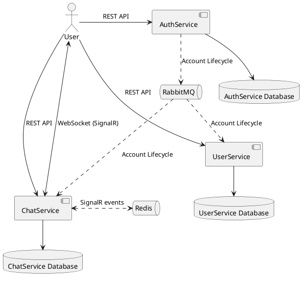

# Architecture Components

## Communication Diagram

```plantuml
@startuml
'left to right direction
component AuthService as auth
component UserService as user
component ChatService as chat

queue RabbitMQ as mq
queue Redis as redis

database "AuthService Database" as authdb
database "UserService Database" as userdb
database "ChatService Database" as chatdb

auth ..> mq : Account Lifecycle
mq ..> user : Account Lifecycle
mq ...> chat : Account Lifecycle

auth --> authdb
user --> userdb
chat --> chatdb

chat <.> redis : SignalR events

actor User as u

u -> auth : REST API
u -> user : REST API
u <-> chat : WebSocket (SignalR)
u -> chat : REST API

@enduml
```