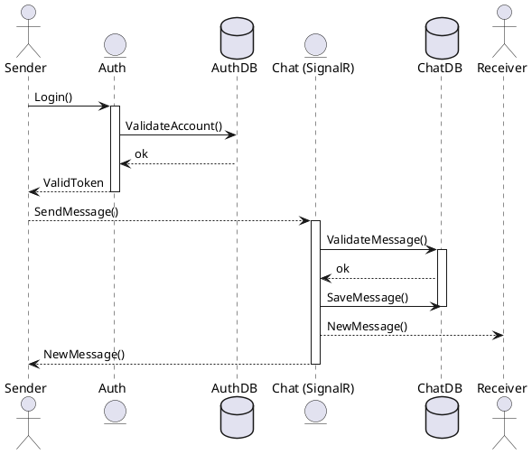

```plantuml
@startuml SendMessageMultipleReplicas
actor Sender
entity "SignalR Replica 1" as Chat
entity Redis
entity "SignalR Replica 2" as Chat2
actor Receiver
Sender --> Chat : Connect()
Receiver --> Chat2 : Connect()
Sender -->  Chat : SendMessage()
activate Chat
Chat -> Chat : ValidateMessage()
Chat --> Redis : NewMessage()
activate Redis
Redis --> Chat : ack
Redis -> Chat2 : NewMessage()
Chat2 --> Redis : ack
deactivate Redis
Chat2 --> Receiver : NewMessage()
Chat --> Sender : NewMessage()
deactivate Chat
@enduml