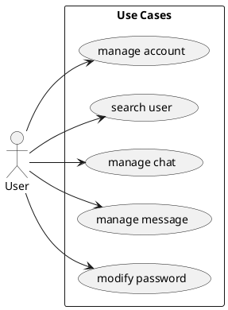

# Use Cases

There is only one type of user for our service. A user owns an account and is able to manage personal information and login data for it. With an account, it's possible to search for other users and create a chat with them. In a chat it's possible to send messages to other users. Once a user has sent a message, he can edit or delete it. The system currently provides 